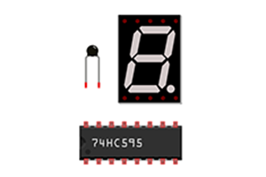
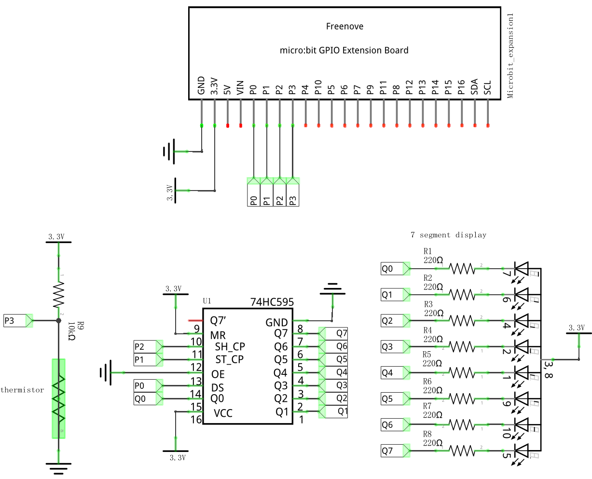

# Makecode-Extension-Starter-Kit

Freenove Starter Kit Extension for makecode, mainly related to thermistors, 74HC595, digital tubes.



## Starter Kit For Microbit
* You can buy the Freenove Micro:Rover from here.<br>
    * United States: https://www.amazon.com/dp/B07QV5VS5W
    * United Kingdom: https://www.amazon.co.uk/dp/B07QV5VS5W
    * Germany: https://www.amazon.de/dp/B07QV5VS5W
    * France: https://www.amazon.fr/dp/B07QV5VS5W
    * Italy: https://www.amazon.it/dp/B07QV5VS5W
    * Spain: https://www.amazon.es/dp/B07QV5VS5W
* You can find all the information about it here.<br>
    * https://github.com/Freenove/Freenove_Micro_Rover/
* You can see its demo video here.
    * https://youtu.be/H7P5lZo29lA
    
## Usage
Function | Description
--- | ---
Freenove.Initialization(DS,ST_CP,SH_CP) | Set the DS pin, ST_CP pin and SH_CP pin of 74HC595 
Freenove.Write_Data(Data,Order) | The data of 0-255 is serially written to 74HC595, and then output in parallel through Q0-Q7. The order of data writing is MSBFIRST or LSBFIRST.
Freenove.Show_Number(Number) | 74HC595 Control Digital Tube Display Number and Letter 0-F
Freenove.Shift_Operators(Data,Shift Operator,Figure) | Move data to the left (x) bit or to the right (x) bit

## Examples:

The file test.ts, which uses most of the blocks in this extension. 



```
Freenove.Initialization(DigitalPin.P0, DigitalPin.P1, DigitalPin.P2)
basic.forever(function () {
    basic.showNumber(Freenove.Thermistor(AnalogPin.P3))
    for (let index = 0; index <= 7; index++) {
        Freenove.Write_Data(Freenove.Shift_Operators(1, shift_operator.left, index), Order.MSBFIRST)
        basic.pause(500)
    }
    for (let index = 0; index <= 7; index++) {
        Freenove.Write_Data(Freenove.Shift_Operators(128, shift_operator.right, index), Order.MSBFIRST)
        basic.pause(500)
    }
    for (let index = 0; index <= 15; index++) {
        Freenove.Show_Number(index)
        basic.pause(500)
    }
})
```
In this example, micro: bit displays the temperature of the current environment, realizes flowing water light on a digital tube, and displays numbers and letters 0-F.
## License

MIT

## Supported targets

* for PXT/microbit
